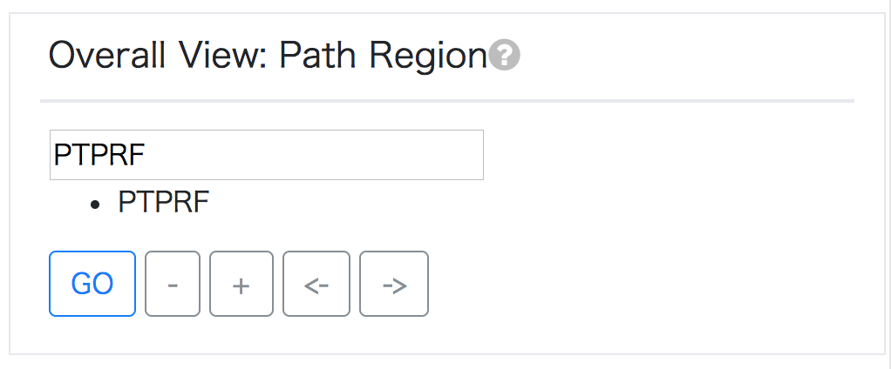

# グラフゲノムブラウザを使ってみる

グラフゲノムブラウザは、ここでは特にヒトゲノムにおける構造多型（Structural Variant）を可視化するために設計されたツールです。全ゲノムレベル、遺伝子レベルなど複数の粒度でのビューが組み合わされており、それぞれのビューで選択した変異を、複数のビューで同時に見ることができるという特徴があります。

ここでは、実際にグラフゲノムブラウザを使ってみることを通して、それぞれのビューでどのようなことができるのか、その役割を紹介したいと思います。

## 準備

まずは、このドキュメントとサンプルデータをダウンロードします。

```bash
$ git clone https://github.com/genomegraph/workshop.git
```

サンプルデータは、

```bash
$ cd browser_tutorial/
$ ls
```

で確認できます。今回はこのディレクトリにあるファイルを利用します。

## 1000人ゲノムのデモデータ

#### [1000 Genomes demo](http://graphgenome.tk/demo):  1000人ゲノムのvcfファイルで表現される全変異の可能性を列挙

1000人ゲノムのデータから、参照配列に対してこのような多型が存在しているような関係性が発見されました。


このような領域は、既存のゲノムブラウザでは以下のように表現されています。


これをグラフゲノムブラウザを用いれば、Alternative配列間の対応関係を陽に記述することが可能になります。

Access to: [chr1:1,200,943-1,201,000 demo](http://graphgenome.tk/demo/?chr1:1,200,943-1,201,000)

## 1個体の構造多型を可視化したい

ここでは、1個体から得られる構造多型のデータセットを可視化して構造多型を発見したい場合、どのような流れで可視化ができるのかを紹介します。ここでは1倍体の細胞データとして、コールされた構造多型が既にデータセットとして公開されている[CHM1](http://eichlerlab.gs.washington.edu/publications/chm1-structural-variation/)を用います。

Access to: [CHM1 demo](http://graphgenome.tk/demo2/)

### 1. Uploader: vcfファイルをアップロードする 


`ファイルを選択`からvcfファイルを選択し、`upload`ボタンをクリックします。

内部では、グラフゲノムブラウザにインテグレーションされた[vcf2ggf](https://github.com/harazono/vcf2ggf)が内部で動き、グラフゲノムフォーマットに変換されます。

一度に全員がvcfファイルをアップロードするのはサーバー側に負荷をかけることになるので、今回は既に解析が済んでいるデータ(CHM1)を見てみましょう。

### 2. Overall View: Circos Plot


Circos Plotは、発生している変異の頻度をとらえるために用いることが可能です。CHM1データセットはinter-chromosomalな変異を含んでいないので、Circos Plotで得られる情報には限りがあります。

### 3. Overall View: Path Region

それでは、もう少し具体的な事例を可視化してみたいと思います。

CHM1の論文[1]にある、SVが近接している例として`PTPRF`遺伝子の周辺の様子をみてみましょう。PathRegionには、塩基配列の座標が入力されていますが、ここでは遺伝子名で検索することもできます。



### 4. Graph View: TubeMap

`PTPRF` 遺伝子における配列の近傍における、読んだ配列における構造多型の繋がり方をみることができます。これはそれほど複雑な例ではありませんが、この区間で挿入と逆位が連続して起きていることがわかります。


## 補遺: `vg view -j`を可視化する

上記のような一連のパイプラインによる個人ゲノムの可視化とは別に、グラフゲノムそれ自体を可視化するための簡易ビューアが用意されています。ここでは、そのビューアの使い方を紹介します。

vg_tutorialをもとに、以下のコマンドを実行します。

```bash
$ vg construct -r x.fa -v x.vcf.gz > graph.vg
$ vg view -j graph.vg  # JSON形式で標準出力する
```

出力されたjsonをクリップボードにコピーします。`pbcopy`が使える環境であれば、

```bash
$ vg view -j graph.vg | pbcopy
```

このコマンドを叩くことで、クリップボードにコピーすることができます。


[グラフゲノムブラウザ](http://graphgenome.tk/demo3/)にアクセスし、まずはブラウザの設定で画面サイズを縮小しましょう。


次に、Uploaderの`textbox` に出力されたJSONを貼り付けます。


すると、[SequenceTubeMap](https://github.com/vgteam/sequenceTubeMap), `Restricted-Layout`, `Sankey-Diagram`（後者2つはウェブ上でのグラフレンダリングを試すために実装しています）の複数の方法でレンダリングされたゲノムグラフを視覚的に確認することができます。

ところがこのままでは見にくいので、テキストボックスの`width`の値を`12800`にしてみましょう。


すると、自動的に`Restricted-Layout`, `Sankey-Diagram`でレンダリングされるグラフの幅が広がり、それぞれのビューでみやすいサイズのゲノムグラフを見ることができるようになりました。


### Reference

1. Pendleton, M., Sebra, R., Pang, A. W. C., Ummat, A., Franzen, O., Rausch, T., … Bashir, A. (2015). Assembly and diploid architecture of an individual human genome via single-molecule technologies. *Nature Methods*, *12*(8), 780–786. https://doi.org/10.1038/nmeth.3454
