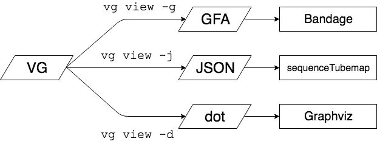

# ハンズオン形式のゲノムグラフ入門

この資料は、過去にやった[ゲノムグラフの入門講義](https://drive.google.com/file/d/1R5Ub5MKmmfUI4pf_H5R2a_I8p2jQz84b/view)と[vgチュートリアル](https://github.com/genomegraph/workshop/blob/master/vg_tutorial/vg_tutorial.md)の中から、とっかかりに必要そうな最小限の内容をピックアップしたものです。


目標は

* ゲノムグラフのイメージを掴む
* ゲノムグラフはどんなファイルに保存されているのかを知る
* グラフを作りかたの一例を学ぶ
* 可視化してグラフになっていることを確かめる
  * かつ、可視化ツールごとインプットの形式を知る

の4点を知ることです。


## 0. 準備

ここは当日は扱わないので、各自準備をお願いします。


### vgのインストール

#### Linuxのヒト

ビルド済みのstatic binaryが用意されています。[ここ](https://github.com/vgteam/vg/releases/tag/v1.13.0)から vg という名前のファイルをダウンロードして、

```bash
chmod +x vg
```

で実行権限をつけてください。必要に応じてパスを通してください。


#### macOSのヒト

static binaryがないので、自分でビルドする必要があります。ビルドする時間がない場合はDockerを使います。

* ビルドの仕方
  * [ここ](https://github.com/vgteam/vg/releases/tag/v1.13.0)から `vg-v1.13.0.tar.gz` という名前のファイルをダウンロードします。
  * 解凍する
  * [Building on MacOS](https://github.com/vgteam/vg#building-on-macos) に従って、必要なライブラリを入れて、環境変数を設定する
  * `. ./source_me.sh && make`
  * `./bin/vg` で動くか確認する

* Dockerを使う場合
  * Docker for mac を[ここ](https://docs.docker.com/docker-for-mac/install/)からインストールする
  * Dockerを立ち上げる
  * `quay.io/vgteam/vg:v1.13.0` をpullする


### Bandageのインストール

自分のOSに合ったものを https://rrwick.github.io/Bandage/  からダウンロードします。

また、BLASTも使うので、https://github.com/rrwick/Bandage/wiki/BLAST-searches に従ってインストールし、パスを通しておきましょう。


### テストデータ

```
git clone https://github.com/genomegraph/workshop.git
cd vg_tutorial/vg_tutorial_190212
ls data
```


## 1. ゲノムグラフとは？

ゲノム配列をグラフ理論的なデータ構造で表現したものです。


ゲノムではありませんが、文字列をグラフ（フローチャート）で表現したという点では[こういう](http://loveallthis.tumblr.com/post/166124704)のもあります。


## 2. どんなファイルフォーマットが使われるの？

ゲノムグラフの表現には、[GFA形式](https://github.com/GFA-spec/GFA-spec)や[FASTG形式](http://fastg.sourceforge.net) が使われることが比較的多いという印象です。ただ、ゲノム配列を記述するFASTA 形式のように広く浸透しているものはなく、ソフトウェアごとに独自にフォーマットが定義されていることも珍しくはないです。ここでは使用ツールとして vg, Bandageだけにフォーカスして知っておくと良いフォーマットを列挙します。詳細は、[ここ](https://drive.google.com/file/d/1R5Ub5MKmmfUI4pf_H5R2a_I8p2jQz84b/view)のP25-49にあります。


* VG形式
  * Protocol Bufferで定義されているバイナリ。ゲノムグラフ解析ツールとしてvgを使用するなら、核となる形式。JSONとほぼ一対一対応するので、自分で処理する場合はJSONに変換する。
* GFA形式/FASTG形式
  * テキストファイル。GFAはタブ区切り、FASTGはFASTAに似ている。Bandage上での可視化に使用する。また、ゲノムアセンブラはGFA or FASTG のどちらかに対応していることが多い印象。
* XG形式
  * バイナリ。VG形式とほぼ等価だが、検索により特化したデータ構造。
* GCSA形式
  * バイナリ。マッピングのときにインデックスとして使用する。
* GAM形式
  * Protocol Buffer形式。SAM/BAM のグラフバージョンと思えば良い。VG形式と同じく、JSONに変換してから処理する。


* グラフ構築


* 可視化




* マッピング


## 3. ハンズオン

### 3.1 データの説明

今回は [Matsuki et al.](https://www.nature.com/articles/ncomms11939) のfigure4で取り上げられているフコシダーゼ遺伝子近傍のゲノム領域を、グラフ構造で表現・可視化してみます。論文の解説は[プレスリリース](https://www.titech.ac.jp/news/2016/035589.html)に任せます。


チュートリアル用に、フコシダーゼ遺伝子近傍のゲノム領域をあらかじめ切り出した塩基配列を3株分（BR-A29, BR-15, BR-07）用意しました（ `data/FL-utilization.fna` ）。また、アノテーションされた遺伝子配列は `data/BR-07.rRNA.fna, data/BR-A29.gene.faa`  に入っています。

論文で使用された全株のゲノムは[ここ](https://www.ncbi.nlm.nih.gov/bioproject/PRJDB4597)に登録されています。


### 3.2 グラフ構築

ゲノムグラフの構築方法はいくつかありますが、ここでは`vg` が提供している方法として、 `msga` を扱ってみます。

`vg msga` は入力で与えられたグラフ(or最初の配列)を核として、配列を1本ずつローカルアラインメントを取りながら、グラフにしていくコマンドです。


```bash
vg msga -f data/FL-utilization.fna -a -P 0.95 -N > graph.vg
```


Dockerを使っている人は、

```
docker run --rm -i -v $(pwd):/work -w /work quay.io/vgteam/vg:v1.13.0
vg msga -f data/FL-utilization.fna -a -P 0.95 -N > graph.vg
```

のようにコンテナを立ちあげてから、中でコマンドを打ちます。


#### 補足

グラフの構築は他にも

* variant call した結果を用いて、`vg construct` する。
* `mafft, clustal omega` などでマルチプルアラインメントをとって、 `vg construct -M` する。
* `vg map, bwa mem, minimap2` などでペアワイズアラインメントをとってGAMファイルを出力し、`vg augment` する。
* GFA形式に吐かれたアセンブリグラフを  `vg view -Fv` でVG形式に変換する。
* [TwoPaco](https://github.com/medvedevgroup/TwoPaCo), [seqwish](https://github.com/ekg/seqwish) などの外部ツールを使う。

などがあります。


### 3.3 可視化

#### Bandage

```
vg view graph.vg > graph.gfa  # GFA形式に吐く。Bandageでみることができる。
```


GFAを出力できたら、あとはBandageを使って、GUIで作業します。

以下Bandageの使い方

1. `File` → `Load graph` から、作成したGFAファイルを選択
2. `Draw graph` で描画
3. 左下の `Create/view BLAST search` を選択
4. `Build BLAST database`
5. `Load from FASTA file` を選択し、`data/BR-07.rRNA.fna` と `data/BR-A29.gene.faa` をロードする。
6. `Run BLAST search`
7. 遺伝子の箇所に色がつく。Node label の `BLAST hit` を選択すると、遺伝子名を出すことができる。


alpha-galactosidaseが今回ターゲットのフコシダーゼです（KEGG上で配列検索してみてください）。ここからグラフをたどっていくと、途中で二手に分岐していることがわかります。ABC輸送体関連遺伝子の方に向かうパスは、フコシルラクトースを利用する菌株 BR-A29, BR-15 です。rRNAの方に向かうパスは BR-07株です。ABC輸送体が乗っていないことがわかります。


#### SequenceTubeMap

```bash
vg view -j graph.vg > graph.json  # JSON形式はsequenceTubeMapの可視化に用いる。
```

吐かれたJSONファイルを http://viewer.momig.tokyo/demo3 でインプットすることで可視化できる。


#### （Graphviz）

```bash
vg view -d graph.vg | dot -Tpdf -o graph.pdf
```


いかがでしたでしょうか？